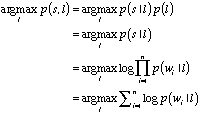

## Language Detection Model
#### Training and testing of a language detection model for the European Parliament Proceedings Parallel Corpus 1996-2011.
#### The project contains two python class files and an iPython notebook file.

See the iPython notebook *LanguageDetectionModel.ipynb* for an example of use.

#### *Algorithm*
Language detection on a sentence from and unknown language is done by finding the language that maximizes the joint probability of the language and the sentence. The joint probability is computed as the conditional probabilty of the sentence given the language multiplied by the probabilty of the language. The probabilty of each language is assumed to be the same so this term is dropped in the maximization. The probabilty of a sentence given a language is simplified by assuming that the words of the sentence are independent. It then becomes the product of each word's probabilty given the language.

The language dependent word probabilities are computed by the training algorithm. It first counts the number of occurences of each word in the language. After all the counts are complete the counts are divided by the total number of word occurances in each language to get probabilities.

In order to prevent underflow log probabilities are summed rather that multipling probabilities.

#### *Results*
Test results: two errors in 21,000 test sentences for an error rate less than 0.01%

#### *Computation Time*
The *LanguageDetectionModel.ipynb* notebook runs in less that 12 minutes on a Macbook Pro (Late 2013)